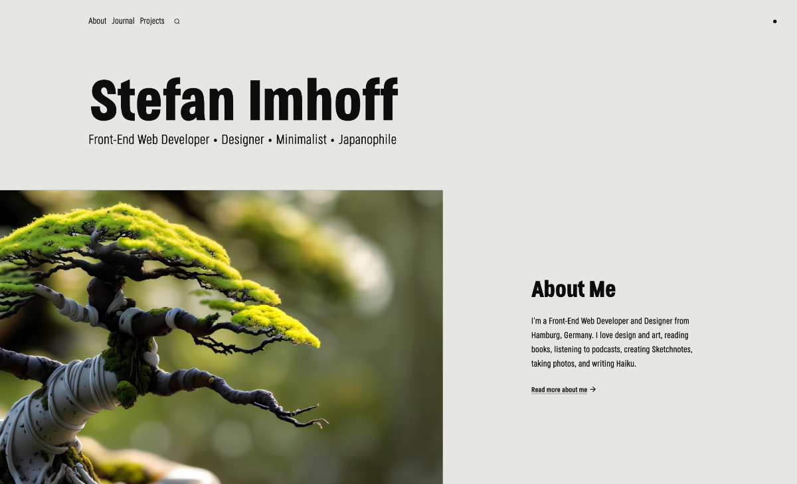

[](https://www.stefanimhoff.de/)



# stefanimhoff.de

This is the source of my [personal website][si] build with [Astro], [Preact], and [Tailwind CSS].

## Installation

```sh
pnpm install
```

## Running the Website

```sh
pnpm dev
```

For more tasks have a look into the `package.json`.

## License

All content is copyrighted by _Stefan Imhoff_ unless otherwise stated. Feel free to learn from the Source Code and reuse code for your projects.

The essays in my [Journal] of this website are licensed under a [Creative Commons license].

The use of my design—the unique combination of layout, photos, or illustrations—my private photos, personal data and logo are only allowed with written permission.

In _easier_ words: **This is not a free theme**. Learn from it. Remix. Reuse. Build your own stuff. You can do it! 🤘

[creative commons license]: https://creativecommons.org/licenses/by-nc-sa/4.0/
[astro]: https://astro.build/
[tailwind css]: https://tailwindcss.com/
[preact]: https://preactjs.com/
[journal]: https://www.stefanimhoff.de/journal/
[si]: https://www.stefanimhoff.de/
